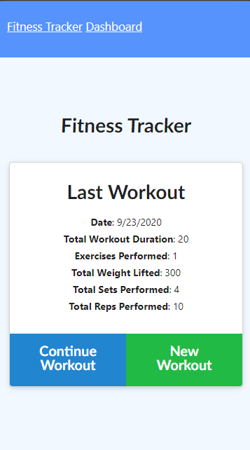
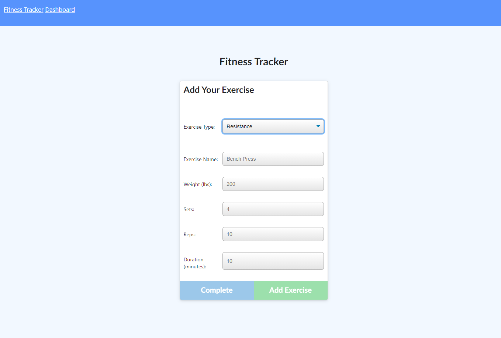
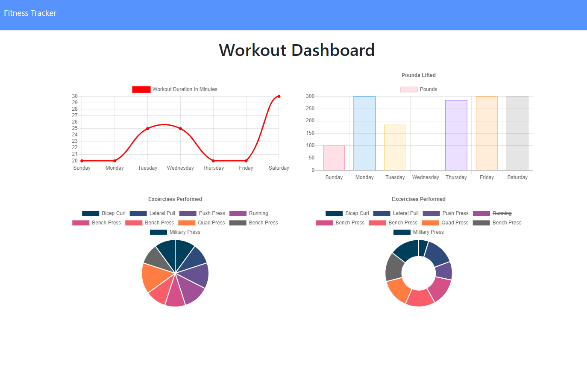

#### Project Name 
# Fitness Tracker 

## Description
This application provides and online fitness tracking system that you can access from anywhere, just select new workout to make a new one or continue to continue and existing one. Feel free to reach out with any questions!  
## Table of Contents  
- [Description](#description)
- [Installation](#installation)
- [Usage](#usage)
- [Contributing](#contributing)
- [Tests](#tests)
- [License](#license)
- [Questions](#questions)  
## Media
Home Page (Mobile)
 

New/Edit Movement Page (Desktop)

Stats Page (Desktop)
 
## Installation  
No installation required to use, but if you want to run the base application yourself just download or clone the git repository and run "npm install" to get all the dependencies you need.
## Usage
Just select either new or continue, "new workout" gets you a new container that you can add exercises to or select "continue workout" to add movements to the last container.
## Contributing
Just reach out to me for questions on contributions.
## Tests
N/A  
## License
This application is covered under the GPLv3 license.

## Questions
Please send questions or inquiries to: samgreilick@gmail.com